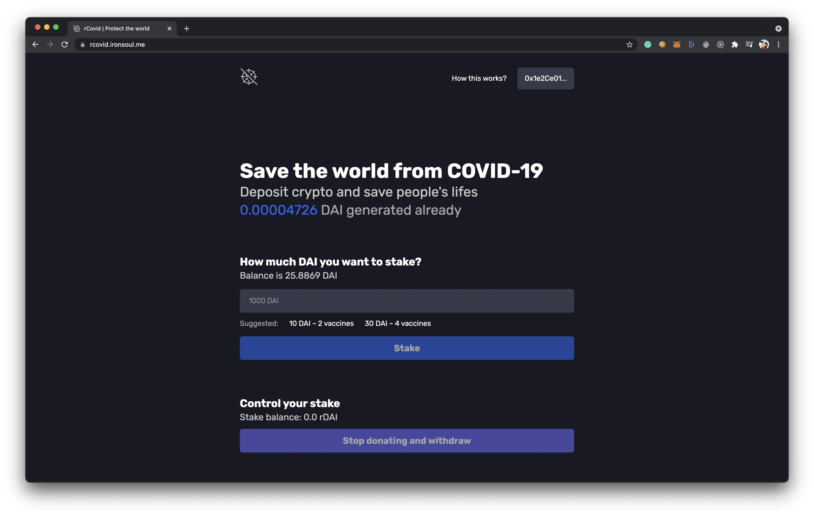

<h1 align="center">
  rcovid.xyz
</h1>
<p align="center">
   Built with <a href="https://www.nextjs.org/" target="_blank">Next.js</a> and hosted with <a href="https://www.vercel.com/" target="_blank">Vercel</a>
</p>



## 🛠 Wanna fork and create your own version?

1. Clone the project

   ```sh
   git clone https://github.com/ironsoul0/rcovid.xyz
   ```

2. Fill in the environmental variables. `.env.sample` is a sample file you can follow.

  ```sh
  NEXT_PUBLIC_INFURA_ID=f40be16d787e47168253bf632e6a7bcd
  NEXT_PUBLIC_TARGET_CHAIN_ID=42
  NEXT_PUBLIC_HAT_ID=746
  NEXT_PUBLIC_RECIPIENT_ID=0x51551EBfE65CCcE40DC5C4664E4b2b475B018dBB
  ```

3. Install the dependencies

   ```sh
   cd rcovid.xyz
   yarn
   ```

4. Start the development server

   ```sh
   yarn dev
   ```

## 🚁 Contributing

Feel free to contribute and suggest any improvements.

This repository is a full source of the website created using Next.js, Ethers.js, TypeScript and React.

